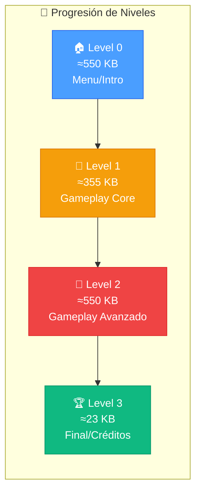

<div align="center">

# 🏚️ SHADOW BASEMENT

### *Un Videojuego de Puzzle 3D desarrollado en Unity*

[](https://unity.com/)
[](https://www.microsoft.com/windows)
[](https://docs.microsoft.com/dotnet/csharp/)
[](https://unity.com/srp/universal-render-pipeline)
[](./LICENSE)

<br>

*"Resuelve puzzles en un sótano misterioso con niveles expandibles y libertad de exploración..."*

<br>

[🎮 Jugar Ahora](#-inicio-rápido) • 
[📖 Documentación](#-arquitectura-técnica) • 
[🎯 Características](#-características-principales) •
[📦 Requisitos](#-requisitos-del-sistema)

</div>

---

## 📋 Tabla de Contenidos

- [🎯 El Problema que Resuelve](#-el-problema-que-resuelve)
- [✨ Características Principales](#-características-principales)
- [🚀 Inicio Rápido](#-inicio-rápido)
- [📁 Estructura del Proyecto](#-estructura-del-proyecto)
- [🎮 Mecánicas de Juego](#-mecánicas-de-juego)
- [📚 Documentación Adicional](#-documentación-adicional)

---

## 🎯 El Problema que Resuelve

**Shadow Basement** es un **videojuego de Puzzle 3D** con sistema de niveles expandibles que combina:

| Aspecto | Solución Implementada |
|---------|----------------------|
| **Inmersión Visual** | Pipeline de renderizado moderno con URP para efectos visuales de alta calidad |
| **Sistema de Cámara Cinematográfico** | Integración de Cinemachine para transiciones fluidas y momentos dramáticos |
| **Controles Responsivos** | Input System de última generación para mapeo flexible de controles |
| **Diseño de Niveles** | Escenarios construidos con ProBuilder para un diseño preciso y optimizado |
| **Rendimiento Óptimo** | Compilación Burst con soporte AVX2/SSE2 para máximo FPS |

> [!NOTE]
> Este proyecto fue desarrollado como parte de un proyecto académico de videojuegos, demostrando competencias avanzadas en desarrollo de videojuegos 3D con Unity.

---

## ✨ Características Principales

### 🎮 Gameplay
- 🧩 **Puzzles Desafiantes** - Resuelve acertijos y desafíos en cada nivel
- 🔦 **Exploración Libre** - Navega por un sótano lleno de misterios
- � **Niveles Expandibles** - Sistema modular que permite añadir nuevos niveles con libertad
- 🎬 **Secuencias Cinemáticas** - Momentos narrativos con cámaras dinámicas

### 🛠️ Técnicas
- ⚡ **Renderizado URP** - Gráficos optimizados con Universal Render Pipeline
- 🎥 **Cinemachine Integration** - Sistema de cámaras profesional
- 📝 **Visual Scripting** - Lógica de juego accesible y mantenible
- 🚀 **Burst Compiler** - Código nativo de alto rendimiento

---

## 🚀 Inicio Rápido

### Instalación

```bash
# 1. Clonar el repositorio
git clone https://github.com/usuario/Shadow-Basement.git

# 2. Navegar al directorio del juego
cd Shadow-Basement/Shadow\ Basement/
```

### Ejecución

<table>
<tr>
<td>

**🖱️ Método 1: Doble clic**

Navega a la carpeta `Shadow Basement` y ejecuta:

```
Shadow Basement.exe
```

</td>
<td>

**💻 Método 2: Línea de comandos**

```powershell
cd "Shadow Basement"
.\Shadow" "Basement.exe
```

</td>
</tr>
</table>

> [!TIP]
> Si el juego no inicia, asegúrate de que todos los archivos (`UnityPlayer.dll`, `UnityCrashHandler64.exe`) estén en el mismo directorio que el ejecutable.

---

## 📁 Estructura del Proyecto

```
Shadow-Basement/
├── 📄 README.md                           # Este archivo
├── 📄 PrietoGarciaRuben-ProyectoVideojuegos.pdf  # Documentación académica
├── 📊 Shadow Basement.pptx                # Presentación del proyecto
│
└── 🎮 Shadow Basement/                    # Build ejecutable
    ├── 🎯 Shadow Basement.exe             # Ejecutable principal (650 KB)
    ├── 🔧 UnityPlayer.dll                 # Motor de Unity (29 MB)
    ├── 🛡️ UnityCrashHandler64.exe         # Manejador de errores
    │
    ├── 📂 Data/
    │   └── 📂 Plugins/x86_64/
    │       └── 📄 lib_burst_generated.*   # Código Burst compilado
    │
    ├── 📂 MonoBleedingEdge/               # Runtime de Mono
    │   ├── 📂 EmbedRuntime/
    │   │   ├── mono-2.0-bdwgc.dll        # Runtime principal (7.5 MB)
    │   │   └── MonoPosixHelper.dll       # Helpers cross-platform
    │   └── 📂 etc/                        # Configuración del runtime
    │
    └── 📂 Proyecto Videojuegos_Data/      # Datos del juego
        ├── 📂 Managed/                    # Assemblies .NET (116 DLLs)
        │   ├── Assembly-CSharp.dll       # Código del juego (95 KB)
        │   ├── Cinemachine.dll           # Sistema de cámaras
        │   ├── Unity.*.dll               # Paquetes de Unity
        │   └── UnityEngine.*.dll         # Módulos del motor
        │
        ├── 📂 Resources/                  # Recursos predeterminados
        ├── 📂 Plugins/                    # Plugins nativos
        │
        ├── 🌍 level0                      # Nivel 0: ~550 KB (Menu/Intro)
        ├── 🌍 level1                      # Nivel 1: ~355 KB (Gameplay)
        ├── 🌍 level2                      # Nivel 2: ~550 KB (Gameplay)
        ├── 🌍 level3                      # Nivel 3: ~23 KB (Final/Credits)
        │
        ├── 🎨 sharedassets0-3.assets      # Assets compartidos por nivel
        ├── 📦 resources.assets            # Assets globales
        ├── ⚙️ globalgamemanagers*         # Configuración global
        ├── 📋 boot.config                 # Configuración de arranque
        └── 📋 app.info                    # Metadatos de la aplicación
```

---

## 🎮 Mecánicas de Juego

### Estructura de Niveles



### Sistemas de Cámara (Cinemachine)

El juego implementa un sofisticado sistema de cámaras con:

| Sistema | Función |
|---------|---------|
| **Virtual Cameras** | Múltiples perspectivas de cámara intercambiables |
| **Impulse Manager** | Efectos de sacudida para impactos y sustos |
| **Storyboard** | Overlays visuales para cutscenes |
| **Update Tracker** | Sincronización precisa con el game loop |
| **Volume Settings** | Integración con post-processing URP |

---

## 📚 Documentación Adicional

### Archivos de Referencia

| Archivo | Descripción |
|---------|-------------|
| [📄 PrietoGarciaRuben-ProyectoVideojuegos.pdf](./PrietoGarciaRuben-ProyectoVideojuegos.pdf) | Documentación técnica completa del proyecto |
| [📊 Shadow Basement.pptx](./Shadow%20Basement.pptx) | Presentación visual del proyecto |

### Configuración Avanzada

<details>
<summary><b>Variables de Configuración (boot.config)</b></summary>

| Variable | Valor | Descripción |
|----------|-------|-------------|
| `gfx-enable-gfx-jobs` | `1` | Habilita el multithreading de gráficos |
| `gfx-enable-native-gfx-jobs` | `1` | Usa implementación nativa de jobs |
| `wait-for-native-debugger` | `0` | No espera debugger al inicio |
| `hdr-display-enabled` | `0` | Deshabilita salida HDR |
| `gc-max-time-slice` | `3` | Límite de tiempo de GC (ms) |
| `build-guid` | `b18015c0...` | Identificador único del build |

</details>

---

## 🔧 Solución de Problemas

<details>
<summary><b>❌ El juego no inicia</b></summary>

1. **Verifica los archivos**: Asegúrate de que todos los archivos estén presentes
2. **Visual C++ Redistributable**: Instala el [VC++ 2019 Redistributable](https://aka.ms/vs/16/release/vc_redist.x64.exe)
3. **DirectX**: Actualiza DirectX a la última versión
4. **Antivirus**: Agrega una excepción para la carpeta del juego

</details>

<details>
<summary><b>🐌 Rendimiento bajo</b></summary>

1. **Drivers de GPU**: Actualiza a los últimos drivers
2. **Procesos en segundo plano**: Cierra aplicaciones innecesarias
3. **Resolución**: Reduce la resolución de pantalla
4. **CPU compatible con AVX2**: Para mejor rendimiento, usa un procesador con AVX2

</details>

<details>
<summary><b>💥 Crash al inicio</b></summary>

1. Verifica que `UnityPlayer.dll` no esté bloqueado por el antivirus
2. Ejecuta como administrador
3. Revisa los logs en: `%USERPROFILE%\AppData\LocalLow\DefaultCompany\Proyecto Videojuegos\`

</details>

---

## 👨‍💻 Autor

<div align="center">

**Rubén Prieto García**

*Proyecto desarrollado como parte del curso de Videojuegos*

---

<sub>Desarrollado con ❤️ usando Unity 2022.3.16f1 LTS</sub>

</div>

---

<div align="center">

**[⬆ Volver arriba](#️-shadow-basement)**

</div>

